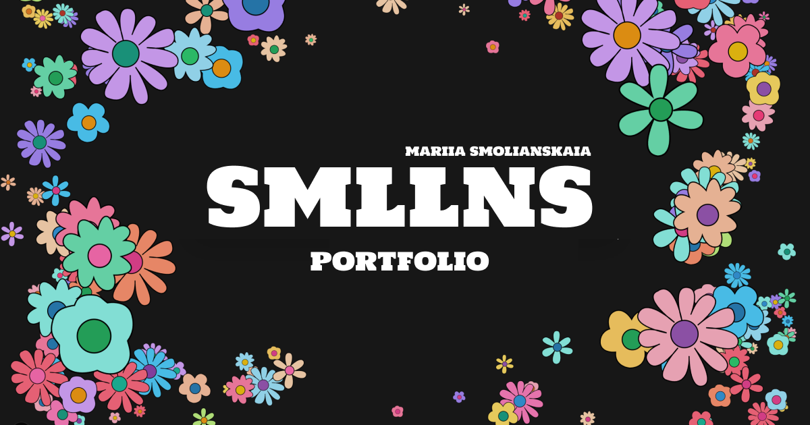

# Smllns Portfolio Website

Welcome to my portfolio website! This project showcases my work, experience, and projects, wrapped in a sleek and modern design. The portfolio is built with **React (Next.js)** and **TypeScript**, and includes interactive features powered by **GSAP**, **Lenis**, **Tailwind CSS**, and **Rough Notation**. It is deployed live on **Vercel**.

---

## Portfolio Preview

---

## Table of Contents

- [About the Project](#about-the-project)
- [Key Features](#key-features)
- [Technologies Used](#technologies-used)
- [Projects](#projects)
- [Live Demo](#live-demo)
- [Contact](#contact)

---

## About the Project

This portfolio serves as a platform to introduce myself and display some of my most recent and notable projects. It includes interactive UI elements, smooth animations, and responsive layouts to provide a seamless user experience. I focused on creating a unique and visually engaging design using **Tailwind CSS** for styling, **GSAP** for animations, **Lenis** for smooth scrolling, and **Rough Notation** for creative text highlighting.

---

## Key Features

- **Personal Introduction:** A section that introduces me, my background, and interests.
- **Project Showcase:** Highlighted projects with detailed descriptions, live links, and interactive elements.
- **Responsive Design:** Fully responsive to ensure an optimized experience on all devices.
- **Smooth Animations:** Implemented using **GSAP** for fluid transitions and engaging interactions.
- **Interactive Scroll:** Smooth scrolling powered by **Lenis**.
- **Text Highlights:** Animated annotations using **Rough Notation**.

---

## Technologies Used

- **React (Next.js):** For building the user interface and server-side rendering.
- **TypeScript:** Ensuring type safety and reliable code.
- **Tailwind CSS:** Utility-first styling for flexible and responsive design.
- **GSAP:** Advanced animations and scroll-triggered effects.
- **Lenis:** Smooth and customizable scrolling.
- **Rough Notation:** For animated text highlights and callouts.
- **Vercel:** Hosting and deployment with optimized performance.

---

## Projects

Here are the main projects featured in the portfolio:

- **Lunera:** A design agency website where I handled full frontend development, animations, and smooth transitions to showcase services and projects.
- **Film Club:** Personal movie showcase website featuring curated collections and smooth browsing experience.
- **MoodFlow:** Mood tracking app with interactive charts and analytics to visualize daily emotions.
- **Crumb Bakery:** Bakery website with colorful design and scroll-based animations.
- **FE Interview Hub:** Frontend interview practice platform with project-based examples and resources.

---

## Live Demo

You can check out the live version of the portfolio deployed on **Vercel**:

[Live Demo on Vercel](https://smllns-portfolio.vercel.app)

---

## Contact

Feel free to reach out for questions, collaboration, or opportunities!

- **Email:** marysmoly@gmail.com
- **LinkedIn:** [LinkedIn Profile](https://www.linkedin.com/in/smllns/)
- **GitHub:** [GitHub Profile](https://github.com/smllns)
